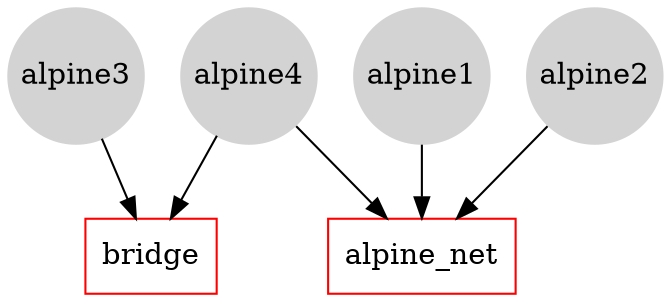

# Networking with standalone containers

[](https://hackmd.io/5KCTsfhSTpudrMUXZNSM0g)

> Based on:
> * https://docs.docker.com/network/
> * https://training.play-with-docker.com/docker-networking-hol/
---


## Networking overview

One of the reasons Docker containers and services are so powerful is that you can connect them together, or connect them to non-Docker workloads. Docker containers and services do not even need to be aware that they are deployed on Docker, or whether their peers are also Docker workloads or not. Whether your Docker hosts run Linux, Windows, or a mix of the two, you can use Docker to manage them in a platform-agnostic way.

This section introduces some basic Docker networking concepts and prepares you to design and deploy your applications to take full advantage of these capabilities.

### Network drivers
Docker’s networking subsystem is pluggable, using drivers. Several drivers exist by default, and provide core networking functionality:

* `bridge`: The default network driver. If you don’t specify a driver, this is the type of network you are creating. Bridge networks are usually used when your applications run in standalone containers that need to communicate. 
* `host`: For standalone containers, remove network isolation between the container and the Docker host, and use the host’s networking directly. 
* `overlay`: Overlay networks connect multiple Docker daemons together and enable swarm services to communicate with each other. You can also use overlay networks to facilitate communication between a swarm service and a standalone container, or between two standalone containers on different Docker daemons.  
* `macvlan`: Macvlan networks allow you to assign a MAC address to a container, making it appear as a physical device on your network. The Docker daemon routes traffic to containers by their MAC addresses. Using the macvlan driver is sometimes the best choice when dealing with legacy applications that expect to be directly connected to the physical network, rather than routed through the Docker host’s network stack. 
* `none`: For this container, disable all networking. Usually used in conjunction with a custom network driver.  
* `Network plugins`: You can install and use third-party network plugins with Docker. These plugins are available from Docker Hub or from third-party vendors. 

### Networking with standalone containers
> https://docs.docker.com/network/network-tutorial-standalone/

This section includes two different parts: 
1. Use the default bridge network demonstrates how to use the default bridge network that Docker sets up for you automatically. 

2. Use user-defined bridge networks shows how to create and use your own custom bridge networks, to connect containers running on the same Docker host. This is recommended for standalone containers running in production.

---

## Use the default bridge network
In this example we use two different `alpine` containers on the same Docker host and do some tests to understand how they communicate with each other. 


**List current networks** Here’s what you should see if you’ve never added a network or initialized a swarm on this Docker daemon. You may see different networks, but you should at least see these (the network IDs will be different):

``` 
$ docker network ls

NETWORK ID          NAME                DRIVER              SCOPE
17e324f45964        bridge              bridge              local
6ed54d316334        host                host                local
7092879f2cc8        none                null                local
```

The default bridge network is listed, along with host and none. The latter two are not fully-fledged networks, but are used to start a container connected directly to the Docker daemon host’s networking stack, or to start a container with no network devices.

The output above shows that the bridge network is associated with the bridge driver. It’s important to note that the network and the driver are connected, but they are not the same. In this example the network and the driver have the same name - but they are not the same thing!

The output above also shows that the bridge network is scoped locally. This means that the network only exists on this Docker host. This is true of all networks using the bridge driver - the bridge driver provides single-host networking.

All networks created with the bridge driver are based on a Linux bridge (a.k.a. a virtual switch).


We start two `alpine` containers running `ash`, which is Alpine’s default shell rather than bash. The `-dit` flags mean to start the container **detached** (in the background), interactive (with the ability to type into it), and with a TTY (so you can see the input and output). 

Because we have  not specified any `--network` flags, the containers connect to the default bridge network.

```  
$ docker run -dit --name alpine1 alpine ash
$ docker run -dit --name alpine2 alpine ash
```


Check that both containers are actually started:

```bash
$ docker container ls
```
Inspect the bridge network to see what containers are connected to it:

```bash
$ docker network inspect bridge
```


The containers are running in the background. Use the docker attach command to connect to 'alpine1'.

``` bash 
$ docker attach alpine1
```
The prompt changes to `#` to indicate that we are the root user within the container. The `ip addr show` command shows the network interfaces for 'alpine1' as they look from within the container:

```bash
# ip addr show
```

From within alpine1, we make sure that we can connect to the internet by pinging google.com. The -c 2 flag limits the command to two ping attempts.

```bash
# ping -c 2 google.com

```

Now we try to ping the second container. First, ping it by its IP address, 172.17.0.3:

```
# ping -c 2 172.17.0.3
```

Next, try pinging the 'alpine2' container by container name... spoiler alert **this will fail**.

```
# ping -c 2 alpine2
```

:::info
Later we will see why.
:::


Detach from alpine1 without stopping it by using the detach sequence, `CTRL + p CTRL + q` (*hold down CTRL and type p followed by q*). 

We stop and remove both containers.

```
$ docker container stop alpine1 alpine2
$ docker container rm alpine1 alpine2
```

### Use user-defined bridge networks

In this section, we again start two alpine containers, but attach them to a user-defined network called `alpine-net`. These containers are not connected to the default bridge network at all. We then start a third alpine container which is connected to the bridge network but not connected to 'alpine-net', and a fourth alpine container which is connected to both networks.




#### Creating the 'alpine-net' network. 
The `--driver bridge` flag is not necessary since it is the default option;  is used in this example just to show how to specify it.

```
$ docker network create --driver bridge alpine-net
```
#### Listing Docker’s networks:

```
$ docker network ls

$ docker network inspect alpine-net
```

#### Create the four containers. 
**Notice the `--network` flags.** You can only connect to one network during the docker `run` command, so you need to use docker network connect afterward to connect 'alpine4' to the bridge network as well.

```
$ docker run -dit --name alpine1 --network alpine-net alpine ash
$ docker run -dit --name alpine2 --network alpine-net alpine ash
$ docker run -dit --name alpine3 alpine ash
```
and:
``` 
$ docker run -dit --name alpine4 --network alpine-net alpine ash
$ docker network connect bridge alpine4
```
Verify that all containers are running:

```
$ docker container ls
``` 

Inspect the bridge network and the alpine-net network again:

```
$ docker network inspect bridge
```

Containers 'alpine3' and 'alpine4' are connected to the bridge network.

```
$ docker network inspect alpine-net
```
Which shows that containers 'alpine1', 'alpine2', and 'alpine4' are connected to the alpine-net network.

:::info
On user-defined networks like `alpine-net`, containers can both communicate by IP address, and can also resolve a container name to an IP address. This capability is called **automatic service discovery**. 
:::

```bash
$ docker attach alpine1
/ # ping alpine2
/ # ping alpine4
```
From 'alpine1', we cannot connect to 'alpine3' at all, since it is not on the ''alpine-net'' network.

```
/ # ping -c 2 alpine3
ping: bad address 'alpine3'
```
Not only that, but you can’t connect to 'alpine3' from 'alpine1' by its IP address either. 

:::warning
* Detach from 'alpine1' using the detach sequence, (`CTRL + p CTRL + q`).
* `$ docker network inspect bridge` to get the IP address of alpine3
* `/ # docker attach alpine1` 
* `/ # ping -c 2 <IP address alpine3>` 
:::


Remember that 'alpine4' is connected to both the default bridge network and 'alpine-net'. It should be able to reach all of the other containers. However, you will need to address alpine3 by its IP address. Attach to it and run the tests.

```bash
$ docker attach alpine4
/ # ping -c 2 alpine1
/ # ping -c 2 alpine2
/ # ping -c 2 alpine3
/ # ping -c 2 <IP address alpine3>
```

Finally, all machine are connected to the Internet. For example (from alpine4)
```bash
/ # ping google.com
<CTRL + p CTRL + q>
$ docker attach alpine3
/ # ping google.com
```

OK, so we saw how to connect various containers and how to create more complex networks structures using bridges.

Now we stop and remove all containers and the alpine-net network.

```
$ docker container stop alpine1 alpine2 alpine3 alpine4
$ docker container rm alpine1 alpine2 alpine3 alpine4
$ docker network rm alpine-net
```


---

## A last example: configuring a NAT for external connectivity

In this step we’ll start a new NGINX container and map port 8080 on the Docker host to port 80 inside of the container. This means that traffic that hits the Docker host on port 8080 will be passed on to port 80 inside the container.

:::info
NOTE: If you start a new container from the official NGINX image without specifying a command to run, the container will run a basic web server on port 80.
:::

Start a new container based on the official NGINX image by running: 
```bash
$ docker run --name web1 -d -p 8080:80 nginx
```

Review the container status and port mappings by running:

```bash
$ docker ps
``` 
The top line shows the new **web1** container running NGINX. 
The port mapping: `0.0.0.0:8080->80/tcp` maps port 8080 on all host interfaces to port 80 inside the web1 container. This port mapping is what effectively makes the containers web service accessible from external sources (via the Docker hosts IP address on port 8080).

Now that the container is running and mapped to a port on a host interface you can test connectivity to the NGINX web server.
Just point your web browser to the IP and port 8080 of your Docker host, e.g.,:

```
curl 127.0.0.1:8080
```

:::info
NOTE: The port mapping is actually port address translation (PAT).
:::


