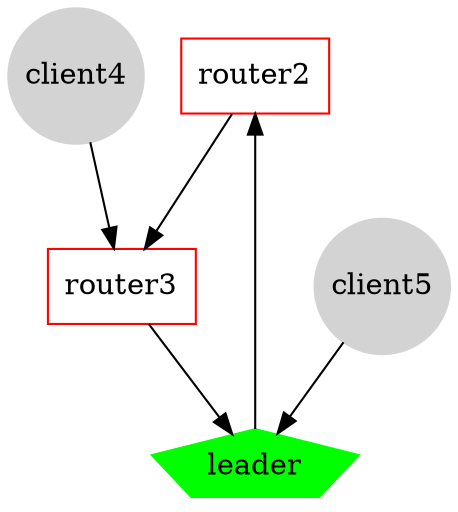

# PART 8: Simulating a Thread network using OpenThread
> :copyright:  https://codelabs.developers.google.com/codelabs/openthread-simulation/#0


:::info
Todo el código necesario para esta sesión de laboratorio está disponible en:[Poliformat/RSE: Recursos/Laboratorio/Maquina Virtual y Código](https://poliformat.upv.es/x/v9KJeS) en la carpeta `codigo_practicas`.

---

Podeis utilizar Docker en vuestra maquina instalandolo siguendo las indicaciones que están aqui: https://docs.docker.com/get-docker/

Existe tambien una maquina virtual especifica para el uso de Docker en: 
**RSE: Recursos /  Laboratorio / Maquina Virtual y Código / ubudocker.ova** 

Tienes que utilizar  VirtualBox  con la opción: "Archivo / Importar servicio virtualizado".

La maquina tiene un usuario "**docker**" con password "**docker**"
:::

## Introduction

[OpenThread](https://github.com/openthread) released by Google is an open-source implementation of the [Thread](http://threadgroup.org/) networking protocol. Google Nest has released OpenThread to make the technology used in Nest products broadly available to developers to accelerate the development of products for the connected home.

The [Thread specification](https://www.threadgroup.org/ThreadSpec) defines an IPv6-based reliable, secure and low-power wireless device-to-device communication protocol for home applications. OpenThread implements all Thread networking layers including IPv6, 6LoWPAN, IEEE 802.15.4 with MAC security, Mesh Link Establishment, and Mesh Routing.


To understand the terms: **mesh**, **Thread**, and **OpenThread** you have to first watch these videos:
* in [this first video](https://www.youtube.com/watch?v=cV5ktpaJv5Y)  (duration 5:14) Mesh Networking is explained
* then,  [this video](https://www.youtube.com/watch?v=2-69-DcM2NA)  (duration 4:58) offers a brief overview of the  Thread Wireless Technology
* finally, [this video](https://www.youtube.com/watch?v=EUGI4fdY2JU) (duration 1:20) explains how OpenThread is used in Google/Nest products


A longer [video is available here](https://www.youtube.com/watch?v=JPXw5Hw--4M) ... but you can watch it after the lab :)


## Learning OpenThread using Docker

This lab will walk you through simulating a Thread mesh network on emulated devices using Docker.


What you'll learn:
* How to set up the OpenThread build toolchain
* How to simulate a Thread network
* How to authenticate Thread nodes
* How to manage a Thread network with OpenThread Daemon


### Pull the Docker image
The `openthread/codelab_otsim` Docker image features OpenThread and `wpantund` pre-built and ready to use.

```bash
$ sudo docker pull openthread/codelab_otsim:latest
``` 

### Simulate a Thread network
The example application you'll use for this Codelab demonstrates a minimal OpenThread application that exposes the OpenThread configuration and management interfaces via a basic command-line interface (CLI).

This exercise takes you through the minimal steps required to ping one emulated Thread device from another emulated Thread device.

:::info
This first exercise does not include any network parameter configuration, such as the IEEE 802.15.4 PAN ID or the Thread Master Key. OpenThread currently implements default values for network parameters (which can be changed later via the CLI).
::: 

The figure below describes a basic Thread network topology. For this exercise, we'll emulate the two nodes within the green circle: a Thread Leader and Thread Router with a single connection between them.


#### Create the network

**1. Start Node 1**

In a terminal window, we start a Docker container from the image and connect to its bash shell:

```bash
$ sudo docker run --name codelab_otsim_ctnr -it --rm \
   --sysctl net.ipv6.conf.all.disable_ipv6=0 \
   --cap-add=net_admin openthread/codelab_otsim bash
``` 

Note the flags:
* `--sysctl net.ipv6.conf.all.disable_ipv6=0`:  this enables IPv6 within the container
* `--cap-add=net_admin`: enables the NET_ADMIN capability, which allows you to execute network-related operations, such as adding IP routes

Once in the container, prompt similar will look like this (`c0f3912a74ff` is the Container ID):

```
root@c0f3912a74ff:/#
``` 

In the Docker container, we navigate to the `openthread`directory and spawn the CLI process for an emulated Thread device using the **ot-cli-ftd** binary; this binary implements an OpenThread device emulated on top of POSIX.
:::info
Remember: FTD -> Full Thread Device
:::

```bash 
# cd /root/src/openthread
# ./output/simulation/bin/ot-cli-ftd 1
``` 
 

The IEEE 802.15.4 radio driver is implemented on top of UDP (IEEE 802.15.4 frames are passed within UDP payloads).

The **argument of 1** is a file descriptor that represents the least-significant bits of the "factory-assigned" IEEE EUI-64 for the emulated device. This value is also used when binding to a UDP port for IEEE 802.15.4 radio emulation (port = 9000 + file descriptor). Each instance of an emulated Thread device in this lab will use a different file descriptor.

:::warning
Only file descriptors of 1 or greater can be used when spawning the process for an emulated device. A file descriptor of 0 is reserved for other use.
:::

:::info
IMPORTANT: If you don't see the > prompt after running this command, press enter.
:::

**Creating a new Operational Dataset and commit it as the active one.**

An Operational Dataset is the **configuration** for the Thread network we are creating.

Command `dataset init new`  creates a new Operational Dataset with **random values**.

```
> dataset init new
Done
> dataset
```
you will get something like this
```
Active Timestamp: 1
Channel: 20
Channel Mask: 07fff800
Ext PAN ID: d6263b6d857647da
Mesh Local Prefix: fd61:2344:9a52:ede0/64
Master Key: e4344ca17d1dca2a33f064992f31f786
Network Name: OpenThread-c169
PAN ID: 0xc169
PSKc: ebb4f2f8a68026fc55bcf3d7be3e6fe4
Security Policy: 0, onrcb
Done
```
and finally:
```
> dataset commit active
Done
```
:::info
IMPORTANT:  note down the:
**Master Key** (in this case e4344ca17d1dca2a33f064992f31f786) and the 
**PAN ID** (in this case 0xc169)
:::

:::danger
1. Indica los datos del "Operation Dataset" que has creato:
- Master Key: 
- Network Name: 
- PAN ID:

Apunta el resultado en el documento a entregar.
:::

We bring up the IPv6 interface:

```
> ifconfig up
Done
```

We start Thread protocol operation:

```
> thread start
Done
```

We wait a few seconds and verify that the device has become the Thread **Leader**. The Leader is the device responsible for managing router ID assignment.

```
> state
leader
Done
```
View the IPv6 addresses assigned to Node 1's Thread interface:

```
> ipaddr
fd61:2344:9a52:ede0:0:ff:fe00:fc00
fd61:2344:9a52:ede0:0:ff:fe00:5000
fd61:2344:9a52:ede0:d041:c5ba:a7bc:5ce6
fe80:0:0:0:94da:92ea:1353:4f3b
Done
```


Note the specific IPv6 address types:
* Begins with fd = mesh-local
* Begins with fe80 = link-local

:::danger
2. Indica la dirección link-local de tu dispositivo.

Apunta el resultado en el documento a entregar.
:::


Mesh-local address types are classified further:
* Contains ff:fe00 = Router Locator (RLOC)
* Does not contain ff:fe00 = Endpoint Identifier (EID) ⇢ 
in this case = **fd61:2344:9a52:ede0:d041:c5ba:a7bc:5ce6**

:::danger
3. Indica el Endpoint Identifier (EID) del primer dispositivo.

Apunta el resultado en el documento a entregar.
:::


The RLOC will change as the network topology changes and a Thread device switches between states. The EID is independent of topology changes and will remain static.

**2. Start Node 2**
Open a new terminal and execute a **bash shell in the currently running Docker container** to use for Node 2.

```
$ sudo docker exec -it codelab_otsim_ctnr bash
```
As before, we navigate to the openthread directory and spawn the CLI process. This is the second emulated Thread device:

```
# cd ~/src/openthread
# ./output/simulation/bin/ot-cli-ftd 2
```

We now configure the Thread Master Key and PAN ID, **using the  values of Node 1's Operational Dataset**, for example (remember to use your own values):

```
> dataset masterkey e4344ca17d1dca2a33f064992f31f786
Done
> dataset panid 0xc169
Done
> dataset commit active
Done
> ifconfig up
Done
> thread start
Done
```
The device will initialize itself as a Child. A Thread Child is equivalent to an End Device, which is a Thread device that transmits and receives unicast traffic only with a Parent device.

```
> state
child
Done
```
Within 2 minutes you should see the state switch **from child to router**. A Thread Router is capable of routing traffic between Thread devices. It is also referred to as a Parent.

```
> state
router
Done
```


#### Verify the network
An easy way to verify the mesh network is to look at the router table.

**1. Check connectivity**
We get the RLOC16 of Node 2. The RLOC16 is the last 16 bits of the device's RLOC IPv6 address.

```
> rloc16
5800
Done
```

We check, on Node 1, the router table for Node 2's RLOC16. We have to be  sure that Node 2 has switched to the router state first.

```
> router table
| ID | RLOC16 | Next Hop | Path Cost | LQ In  | LQ Out  | Age | Extended MAC     |
+----+--------+----------+-----------+--------+---------+-----+------------------+
| 20 | 0x5000 |       63 |         0 |      0 |       0 |   0 | 96da92ea13534f3b |
| 22 | 0x5800 |       63 |         0 |      3 |       3 |  23 | 5a4eb647eb6bc66c |
```
Node 2's RLOC of 0x5800 is found in the table, confirming that it is connected to the mesh.

**2. Ping Node 1 from Node 2**
Verify connectivity between the two emulated Thread devices. In Node 2, ping the EID assigned to Node 1:

```
> ping fd61:2344:9a52:ede0:d041:c5ba:a7bc:5ce6
> 16 bytes from fd61:2344:9a52:ede0:d041:c5ba:a7bc:5ce6: icmp_seq=1 hlim=64 time=12ms
```

:::danger
4. Indica la latencia del Ping al Node 1 desde el nodo Node 2 en el documento a entregar.
:::


#### Test the network
Now that you can successfully ping between two emulated Thread devices, **test the mesh network by taking one node offline**.

Return to Node 1 and stop Thread:

```
> thread stop
Done
```
Switch to Node 2 and check the state. Within two minutes, Node 2 detects that the leader (Node 1) is offline, and you should see Node 2 transition to be the leader of the network:

```
> state
router
Done
...
> state
leader
Done
```

Once confirmed, stop Thread and factory reset Node 2 before exiting back to the Docker bash prompt. A factory reset is done to ensure that the Thread network credentials we used in this exercise are not carried over to the next exercise.

```
> thread stop
Done
> factoryreset
>
> exit
root@c0f3912a74ff:/#
```

_You may have to press enter a few times to bring the > prompt back after a factoryreset command._ 

Do not exit the Docker container.

Also factory reset and exit Node 1:

> factoryreset
>
> exit
root@c0f3912a74ff:/#


---

### Authenticate nodes with Commissioning
In the previous step we set up a Thread network with two simulated devices and verified connectivity. However, this only allows unauthenticated IPv6 link-local traffic to pass between devices. To route global IPv6 traffic between them (and the Internet via a Thread border router), **nodes must be authenticated**.

In order to authenticate, one device must act as a **Commissioner**. The Commissioner is the currently elected authentication server for new Thread devices, and the authorizer for providing the network credentials required for the devices to join the network.

In this step, we will use the same two-node topology as before. For authentication, the Thread Leader will act as the Commissioner, the Thread Router as a Joiner.


:::info
Devices without Thread interfaces may also perform the Commissioner role. For example, a cell phone or a server in the cloud can provide the interface by which a human administrator joins a new device to the Thread Network. These devices are called External Commissioners.
:::

Continuing from the previous exercise we will use again the two bash prompts within the same Docker container.

### Create a network
In Node 1, spawn the CLI process:

```
root@c0f3912a74ff:/# cd ~/src/openthread
root@c0f3912a74ff:/# ./output/simulation/bin/ot-cli-ftd 1
```

Create a new Operational Dataset, commit it as the active one, and start Thread:

```
> dataset init new
Done
> dataset
Active Timestamp: 1
Channel: 12
Channel Mask: 07fff800
Ext PAN ID: e68d05794bf13052
Mesh Local Prefix: fd7d:ddf7:877b:8756/64
Master Key: a77fe1d03b0e8028a4e13213de38080e
Network Name: OpenThread-8f37
PAN ID: 0x8f37
PSKc: f9debbc1532487984b17f92cd55b21fc
Security Policy: 0, onrcb
Done
> dataset commit active
Done
> ifconfig up
Done
> thread start
Done
```
Wait a few seconds and verify that the device has become a Thread Leader:

```
> state
leader
Done
```

#### Start the Commissioner role
While still on Node 1, start the Commissioner role:

```
> commissioner start
Commissioner: petitioning
Done
> Commissioner: active
```

We will now allow any Joiner (by using the `*` wildcard) with the credential: `J01NME` to *commission* onto the network by doing: 

```
> commissioner joiner add * J01NME
Done
```
A Joiner is a device that is added by a human administrator to a commissioned Thread Network.

:::info
You can choose any Joiner Credential you wish in a different implementation of a Thread network.

Note: The Joiner Credential is a device-specific string of all uppercase alphanumeric characters (0-9 and AY, excluding I, O, Q, and Z for readability), between 6 and 32 characters long.
For more information, see Thread Commissioning (https://openthread.io/guides/building/commissioning).
:::

#### Start the Joiner role
In a second terminal window, in the Docker container, spawn a new CLI process. This is Node 2.

```
root@c0f3912a74ff:/# cd ~/src/openthread
root@c0f3912a74ff:/# ./output/simulation/bin/ot-cli-ftd 2
> ifconfig up
Done
```

On Node 2, enable the Joiner role using the J01NME Joiner Credential.


```
> joiner start J01NME
Done
```
... wait a few seconds for confirmation ...

```
Join success
```
As a Joiner, the device (Node 2) has successfully authenticated itself with the Commissioner (Node 1) and received the Thread Network credentials.

:::warning
If you get a **Join failed** message, the Commissioner may have timed out waiting for a Join request. In that case, restart from the commissioner joiner command. 
:::

You may also receive error and/or log messages on both Nodes 1 and 2 after a successful join, like:
```
> joiner start J01NME
Done
> =========[[THCI] direction=send | type=JOIN_FIN.req | len=048]==========
| 10 01 01 21 0A 4F 50 45 | 4E 54 48 52 45 41 44 22 | ...!.OPENTHREAD"
| 05 50 4F 53 49 58 23 10 | 32 30 31 39 31 31 31 33 | .POSIX#.20191113
| 2D 30 30 32 30 32 2D 67 | 25 06 18 B4 30 00 00 10 | -00202-g%..40...
------------------------------------------------------------------------
=========[[THCI] direction=recv | type=JOIN_FIN.rsp | len=003]==========
| 10 01 01 .. .. .. .. .. | .. .. .. .. .. .. .. .. | ................
------------------------------------------------------------------------
[THCI] direction=recv | type=JOIN_ENT.ntf
[THCI] direction=send | type=JOIN_ENT.rsp
Join success
```
These are normal and can be ignored.

Now that Node 2 is authenticated, start Thread (on both nodes):

```
> thread start
Done
```
:::danger
5. Indica el documento a entregar el mensaje obtenido en pantalla despues del Join. Es algo tipo: 

``` 
Commissioner: Joiner connect d65e64fa83f81cf7
[[NONE]]=========[[THCI] direction=recv | type=JOIN_FIN.req | len=053]==========
[[NONE]]| 10 01 01 21 0A 4F 50 45 | 4E 54 48 52 45 41 44 22 | ...!.OPENTHREAD"
[[NONE]]| 0A 53 49 4D 55 4C 41 54 | 49 4F 4E 23 10 32 30 31 | .SIMULATION#.201
...
```
:::


#### Validate network authentication
Check the state on Node 2, to validate that it has now joined the network. Within two minutes, Node 2 transitions from child to router:

```
> state
child
Done
...
> state
router
Done
```


#### Reset configuration
To prepare for the next step, reset the configuration. On each Node, stop Thread, do a factory reset, and exit the emulated Thread device:

```
> thread stop
Done
> factoryreset
>
> exit
root@c0f3912a74ff:/#
```

### Creating complex networks

In this section we will implement a more complex network:





We will need 5 nodes: 1 leader, 2 routers and 2 child.

:::warning
We will use the word child and childs, altough grammatically incorrect to indicate 1 or more child nodes
:::

Executing the first node:
```
$ sudo docker run --name codelab_otsim_ctnr -it --rm\
    --sysctl net.ipv6.conf.all.disable_ipv6=0\
    --cap-add=net_admin openthread/codelab_otsim bash
...
root@c9f1c6a8f32a:/# cd ~/src/openthread/
root@c9f1c6a8f32a:~/src/openthread# ./output/simulation/bin/ot-cli-ftd 1

> dataset init new
Done
> dataset
Active Timestamp: 1
Channel: 13
Channel Mask: 07fff800
Ext PAN ID: 2623047c61a34cc6
Mesh Local Prefix: fdaa:9c5c:5a7b:f781/64
Master Key: 3bfcc6271f185fe33d8fa6119caa3d6e
Network Name: OpenThread-84ee
PAN ID: 0x84ee
PSKc: 76c5920bb8a76192fb2f5b11b6f09aa5
Security Policy: 0, onrcb
Done
> dataset commit active
Done
> ifconfig up
Done
> thread start
Done
> state
leader
Done
> 
```

Activate Leader as commissioner:
```
> commissioner start
Commissioner: petitioning
Done
> Commissioner: active

> commissioner joiner add * R3THREAD 600
Done
```

:::warning
Where 600 is the value of the joiner timeout in seconds (i.e., 10 minutes). If you are not fast enough in typing the following commands yo can use an higher value
:::

We now execute the other 2 routers (number 2 and 3):

```
$ sudo docker exec -it codelab_otsim_ctnr bash
root@c9f1c6a8f32a:/# cd ~/src/openthread/
root@c9f1c6a8f32a:~/src/openthread# ./output/simulation/bin/ot-cli-ftd 2

> ifconfig up
Done
> joiner start R3THREAD
Done
... some text ...
Join success
> thread start
Done
> state 
router
Done
> 
```

:::warning
Transition to state 'router' can take various seconds!

If you get a Join failed message, the Commissioner may have timed out waiting for a Join request. In that case, restart from the commissioner joiner command. Don't wait too long after starting the Commissioner to enable the Joiner role.

:::

Now we have 1 Leader and 2 routers. from any node we can check the routing table or our neighbours:

From the Leader:
```
> router table
| ID | RLOC16 | Next Hop | Path Cost | LQ In | LQ Out | Age | Extended MAC     |
+----+--------+----------+-----------+-------+--------+-----+------------------+
|  5 | 0x1400 |       12 |         1 |     3 |      3 |  26 | 1e7bfb6270c9eab6 |
|  8 | 0x2000 |       63 |         0 |     0 |      0 |   0 | 86c45e49822461c6 |
| 12 | 0x3000 |        5 |         1 |     3 |      3 |  29 | fe09fc7604b6f2d9 |

Done
> neighbor table
| Role | RLOC16 | Age | Avg RSSI | Last RSSI |R|S|D|N| Extended MAC     |
+------+--------+-----+----------+-----------+-+-+-+-+------------------+
|   R  | 0x1400 |  16 |      -20 |       -20 |1|0|1|1| 1e7bfb6270c9eab6 |
|   R  | 0x3000 |  19 |      -20 |       -20 |1|0|1|1| fe09fc7604b6f2d9 |

Done

```
From router 3:
```
> router table
| ID | RLOC16 | Next Hop | Path Cost | LQ In | LQ Out | Age | Extended MAC     |
+----+--------+----------+-----------+-------+--------+-----+------------------+
|  5 | 0x1400 |        8 |         1 |     3 |      3 |   0 | 1e7bfb6270c9eab6 |
|  8 | 0x2000 |        5 |         1 |     3 |      3 |  28 | 86c45e49822461c6 |
| 12 | 0x3000 |       63 |         0 |     0 |      0 |   0 | fe09fc7604b6f2d9 |

Done
> neighbor table
| Role | RLOC16 | Age | Avg RSSI | Last RSSI |R|S|D|N| Extended MAC     |
+------+--------+-----+----------+-----------+-+-+-+-+------------------+
|   R  | 0x1400 |  32 |      -20 |       -20 |1|0|1|1| 1e7bfb6270c9eab6 |
|   R  | 0x2000 |  25 |      -20 |       -20 |1|0|1|1| 86c45e49822461c6 |

Done
> 
``` 
**Creating the network**

To create a desired topology and assign childs to the desired routers we use commands `parentpriority x` and command `childmax x`. For example:
```
> parentpriority
-2
Done
```

Priority values can be 1 (highest), 0, -1, -2. To assign a priority we use:
```
> parentpriority 0
Done
```

The value `parentpriority` can be changed at any time. Thanks to this, we will be able to assign a child to a specific router or to the leader. 


The same for the maximum number of childs (the value must be set before launching any child):
```
> childmax 
10 
Done 
> childmax 3 
Done
```


Basically to assign a child to a router, we have to set `parentpriority=1` to the router we want to assign the childs to and `parentpriority=-2` to the others.

**Assigning a child to router 3**

To assign a child to router 3 we have to sewill set `parentpriority 1` to it and `parentpriority -2` to the leader and to router 2, and then:

```
$ sudo docker exec -it codelab_otsim_ctnr bash
root@c9f1c6a8f32a:/# cd ~/src/openthread/
root@c9f1c6a8f32a:~/src/openthread# ./output/simulation/bin/ot-cli-mtd 4

> 
```

It is important to note that we used **`ot-cli-mtd`** and sequence number 4.

```
> ifconfig up
Done
> joiner start R3THREAD
Done
...
> thread start
Done
```

If executing the ```joiner start``` you get a ```Join failed``` you'll have to restart the ```commissioner joiner add * R3THREAD``` in the leader node.


Now, from router 3:
```
> neighbor table
| Role | RLOC16 | Age | Avg RSSI | Last RSSI |R|S|D|N| Extended MAC     |
+------+--------+-----+----------+-----------+-+-+-+-+------------------+
|   C  | 0x6001 | 109 |      -20 |       -20 |1|1|0|0| 1e0466ad64a8d6fd |
|   R  | 0x1800 |   6 |      -20 |       -20 |1|0|1|1| be3a9f9efb2d3931 |
|   R  | 0xf000 |  10 |      -20 |       -20 |1|0|1|1| 5a316d006cbba883 |

Done
> 
```

And from the newly created child:
```
> parent
Ext Addr: aed7c5a4a3333f5b
Rloc: 6000
Link Quality In: 3
Link Quality Out: 3
Age: 7
Done
> 
```

**Assigning a child to the leader**

We create now a child for the Leader by assigning to the Leader `parentpriority 1`  and `parentpriority -2` to the  router 2 and 3, and then, as usual:

```
$ sudo docker exec -it codelab_otsim_ctnr bash
root@c9f1c6a8f32a:/# cd ~/src/openthread/
root@c9f1c6a8f32a:~/src/openthread# ./output/simulation/bin/ot-cli-mtd 5

> 
```

It is important to note that we used **`ot-cli-mtd`** and sequence number 5.

```
> ifconfig up
Done
> joiner start R3THREAD
Done
...
> thread start
Done
```

Now, from the Leader:
```
> neighbor table
| Role | RLOC16 | Age | Avg RSSI | Last RSSI |R|S|D|N| Extended MAC     |
+------+--------+-----+----------+-----------+-+-+-+-+------------------+
|   C  | 0x1803 |  15 |      -20 |       -20 |1|1|0|0| 06eda04756c56f16 |
|   R  | 0x6000 |  16 |      -20 |       -20 |1|0|1|1| aed7c5a4a3333f5b |
|   R  | 0xf000 |  19 |      -20 |       -20 |1|0|1|1| 5a316d006cbba883 |

Done
> child table
| ID  | RLOC16 | Timeout    | Age        | LQ In | C_VN |R|S|D|N| Extended MAC     |
+-----+--------+------------+------------+-------+------+-+-+-+-+------------------+
|   3 | 0x1803 |        240 |        126 |     3 |  230 |1|1|0|0| 06eda04756c56f16 |

Done
> 
```

Another interesting command is:
```
> child list
3 
Done
> child 3
Child ID: 3
Rloc: 1803
Ext Addr: 06eda04756c56f16
Mode: rs
Net Data: 230
Timeout: 240
Age: 145
Link Quality In: 3
RSSI: -20
Done
> 
```

Similar, but related to routers:
```
> router list
6 24 60 
Done
> router 6
Alloc: 1
Router ID: 6
Rloc: 1800
Next Hop: fc00
Link: 0
Done
> 
```
And finally:
```
> childip
1803: fdd9:d378:b10c:139a:ce0e:172d:cda3:a27d
Done
> 
```


Now we can ping from any node to any other node. For example:
The IP address of client5 is:
```
> ipaddr 
fdd9:d378:b10c:139a:0:ff:fe00:1803
fdd9:d378:b10c:139a:ce0e:172d:cda3:a27d
fe80:0:0:0:4ed:a047:56c5:6f16
Done
> 
```

From client 4:
```
> ping fdd9:d378:b10c:139a:ce0e:172d:cda3:a27d
> 16 bytes from fdd9:d378:b10c:139a:ce0e:172d:cda3:a27d: icmp_seq=1 hlim=62 time=11ms
```

**Statistics**

To get statistics about a router's work we can use:
```
> counters mac
TxTotal: 335
    TxUnicast: 95
    TxBroadcast: 240
    TxAckRequested: 95
    TxAcked: 95
    TxNoAckRequested: 240
    TxData: 335
    TxDataPoll: 0
    TxBeacon: 0
    TxBeaconRequest: 0
    TxOther: 0
    TxRetry: 0
    TxErrCca: 0
    TxErrBusyChannel: 0
RxTotal: 552
    RxUnicast: 90
    RxBroadcast: 462
    RxData: 552
    RxDataPoll: 0
    RxBeacon: 0
    RxBeaconRequest: 0
    RxOther: 0
    RxAddressFiltered: 0
    RxDestAddrFiltered: 0
    RxDuplicated: 0
    RxErrNoFrame: 0
    RxErrNoUnknownNeighbor: 0
    RxErrInvalidSrcAddr: 0
    RxErrSec: 0
    RxErrFcs: 0
    RxErrOther: 0
Done
> 
```

and
```
> counters mle
Role Disabled: 0
Role Detached: 1
Role Child: 1
Role Router: 1
Role Leader: 0
Attach Attempts: 1
Partition Id Changes: 1
Better Partition Attach Attempts: 0
Parent Changes: 0
Done
> 
```


:::danger
6. Reporta en el documento a entregar las estadisticas de funcionamiento de los dos routers de la red
:::


