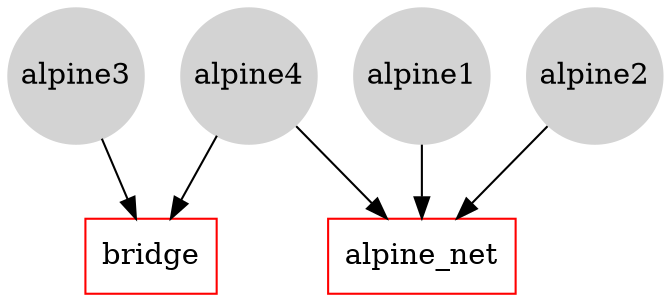

[](https://hackmd.io/oNBMMGCPRmyrjxM6xmXMmw)
> To clean Docker: docker system prune -a


# PART 1: the basics

## Installing Docker

You can download and install Docker on multiple platforms. Refer to the following link: 
https://docs.docker.com/get-docker/


and choose the best installation path for you.

Or you can execute it online: 
https://labs.play-with-docker.com/

## Playing with containers

There are different ways to use containers. These include:

* To run a **single task**: This could be a shell script or a custom app.
* **Interactively**: This connects you to the container similar to the way you SSH into a remote server.
* In the **background**: For long-running services like websites and databases.


## Run a single task "Hello World"

```
$ docker container run hello-world
```


----

## Docker Hub (https://hub.docker.com/)


----

### [`https://hub.docker.com/_/hello-world`](https://hub.docker.com/_/hello-world)


----

### [`https://github.com/docker-library/hello-world`](https://github.com/docker-library/hello-world)


----


----


----


---

## Run an interactive Ubuntu container

The following command runs an ubuntu container, attaches interactively ('`-i`') to your local command-line session ('`-t`'), and runs /bin/bash.

    $ docker run -i -t ubuntu /bin/bash

---

1. If you do not have the ubuntu image locally, Docker pulls it from your configured registry.
1. Docker creates a new container.
1. Docker allocates a read-write filesystem to the container, as its final layer. 
1. Docker creates a network interface to connect the container to the default network. By default, containers can connect to external networks using the host machine’s network connection.
1. Docker starts the container and executes `/bin/bash`. 
1. When you type `exit` to terminate the `/bin/bash` command, the container stops but is not removed. You can start it again or remove it.

---

You can check the images you downloaded using:
```
$ docker image ls
```
and the containers using:
```
$ docker container ls -a
```

:::info
**By the way...**
In the rest of this seminar, we are going to run an ==Alpine Linux== container. Alpine (https://www.alpinelinux.org/) is a lightweight Linux distribution so it is quick to pull down and run, making it a popular starting point for many other images.
:::

```
$ docker image pull alpine

$ docker image ls
```
Some examples:
```
$ docker container run alpine echo "hello from alpine"

$ docker container run alpine ls -l
```


Más ejemplos:
```
$ docker container run alpine /bin/sh

$ docker container run -it alpine /bin/sh
```

¿Que diferencia hay entre estos dos ultimos ejemplos?

E.g.,:
`/ # ip a `


---

## Docker container instances

```
$ docker container ls

$ docker container ls -a
```


---

## Container Isolation

This is a critical security concept in the world of Docker containers! **Even though each docker container run command used the same alpine image, each execution was a separate, isolated container.** Each container has a separate filesystem and runs in a different namespace; by default a container has no way of interacting with other containers, even those from the same image. 

So, let's see:

``` 
$ docker container run -it alpine /bin/ash
/ # echo "hello world" > hello.txt
/ # ls
```

we get to something like this:


To show all Docker containers (both running and stopped) we use `$ docker ps -a`. We will get something like this:

```
$ docker ps -a
CONTAINER ID        IMAGE               COMMAND                  CREATED             STATUS                      PORTS               NAMES
ed8cfb69af14        alpine              "/bin/ash"               3 minutes ago       Exited (0) 10 seconds ago                       optimistic_chatterjee
e700ae985bc0        alpine              "/bin/sh"                5 minutes ago       Exited (0) 5 minutes ago                        zen_goldstine
...
```
Now if we do:

``` 
$ docker container start e700ae985bc0
$ docker exec e700ae985bc0 ls -l
```

We will see that in that container there is not the file "hello.txt"!

## Handling containers

To summarize a little.

To show which Docker containers are running:
```
$ docker ps
``` 
To show all Docker containers (both running and stopped):
```
$ docker ps -a
```
If you don't see your container in the output of `docker ps -a` command, than you have to run an image:
```
$ docker run ...
```

If a container appears in `docker ps -a`  but not in `docker ps`, the container has stopped, you have to restart it:

```
$ docker container start <container ID>
```

If the Docker container is already running (i.e., listed in `docker ps`), you can reconnect to the container in each terminal:

```
$ docker exec -it <container ID> sh
```

### Detached containers

Starts an Alpine container using the  `-dit` flags running `ash`. The container will start **detached** (in the background), interactive (with the ability to type into it), and with a TTY (so you can see the input and output). Since you are starting it detached, you won’t be connected to the container right away.

```
$ docker run -dit --name alpine1 alpine ash
```

Use the docker `attach` command to connect to this container:

``` bash 
$ docker attach alpine1
/ #
```

Detach from alpine1 without stopping it by using the detach sequence, `CTRL + p CTRL + q` (*hold down CTRL and type p followed by q*). 


### Finally:
```
$ docker container stop <node name> (or <container id>)

$ docker container rm <node name> (or <container id>)

```


# PART 2: Building an image: an example with Flask

>**Note:** This lab is based on [Docker Tutorials and Labs](https://github.com/docker/labs/blob/master/beginner/chapters/webapps.md#23-create-your-first-image).
---


## Docker Images
In this section we will build our own image, use that image to run an application locally, and finally, push some of our own images to the 
[](https://hub.docker.com/) 
:::info
The docker hub is also referred to as Docker Store or Docker Cloud.
:::


---


For simplicity, you can think of an image as a git repository, that is images can be [committed](https://docs.docker.com/engine/reference/commandline/commit/) with changes and have multiple versions. 

For example you could pull a specific version of `ubuntu` image as follows:

```bash
$ docker pull ubuntu:12.04
```

---


If you do not specify the version number of the image the Docker client will default to a version named `latest`.

So for example, the `docker pull` command given below will pull an image named `ubuntu:latest`:

```bash
$ docker pull ubuntu
```

---


To get a new Docker image you can either get it from a registry (such as the Docker Store) or create your own. There are hundreds of thousands of images available on [Docker Hub](https://store.docker.com). You can also search for images directly from the command line using `docker search`.

---


An important distinction with regard to images is between _base images_ and _child images_.

- **Base images** are images that have no parent images, usually images with an OS like ubuntu, alpine or debian.

- **Child images** are images that are built on base images and add additional functionality.

---


Another key concept is the idea of _official images_ and _user images_. (Both of which can be base images or child images.)

- **Official images** are Docker sanctioned images. Docker, Inc. sponsors a dedicated team that is responsible for reviewing and publishing all Official Repositories content. This team works in collaboration with upstream software maintainers, security experts, and the broader Docker community. These are not prefixed by an organization or user name. Images like `python`, `node`, `alpine` and `nginx` are official (base) images. 

:::info
To find out more about them, check out the [Official Images Documentation](https://docs.docker.com/docker-hub/official_repos/).
:::

- **User images** are images created and shared by users like you. They build on base images and add additional functionality. Typically these are formatted as `user/image-name`. The `user` value in the image name is your Docker Store user or organization name.

---
___


## Creating our first image
>**Note:** The code of this section is in [this repository](https://www.dropbox.com/sh/e6zxf2t76rvk7e7/AAC7voT8yMAZNkLPpd1iaF34a?dl=0). 


The goal of the next steps is to create a Docker image which will run a [Flask](http://flask.pocoo.org) app.

We'll do this by first pulling together the components for a _random pizza picture generator_ built with Python Flask, then _dockerizing_ it by writing a _Dockerfile_. Finally, we'll build the image, and then run it.

### Create a Python Flask app that displays random pizzas pix

For the purposes of this class, we use a little Python Flask app that displays a random pizza `.gif` every time it is loaded... :smiley:

We have to create the following files:
- app.py
- templates/index.html
- Dockerfile

---

#### app.py


```python
from flask import Flask, render_template
import random

app = Flask(__name__)

# Breakfast Pizzas That Want To Wake Up Next To You
# https://www.buzzfeed.com/rachelysanders/good-morning-pizza
images = [
    "https://img.buzzfeed.com/buzzfeed-static/static/2014-07/22/13/enhanced/webdr10/enhanced-buzz-12910-1406051649-8.jpg",
...
    "https://img.buzzfeed.com/buzzfeed-static/static/2014-07/22/14/enhanced/webdr02/enhanced-buzz-1275-1406053174-20.jpg"
]

@app.route('/')
def index():
    url = random.choice(images)
    return render_template('index.html', url=url)

if __name__ == "__main__":
    # 'flask run --host=0.0.0.0' tells your operating system to listen on all public IPs.
    app.run(host="0.0.0.0")
```

---


#### templates/index.html

```htmlmixed=
<html>
  <head>
    <style type="text/css">
      body {
        background: black;
        color: white;
      }
      div.container {
        max-width: 90%;
        margin: 100px auto;
        border: 20px solid white;
        padding: 10px;
        text-align: center;
      }
      h4 {
        text-transform: uppercase;
      }
    </style>
  </head>
  <body>
    <div class="container">
      <h4>Breakfast Pizzas of the day</h4>
      
      <p><small>Courtesy: <a href="https://www.buzzfeed.com/rachelysanders/good-morning-pizza">Buzzfeed</a></small></p>
    </div>
  </body>
</html>
```

---


### the "Dockerfile"

We want to create a Docker image with this web app. As mentioned above, all user images are based on a _base image_. Since our application is written in Python, we will build our own Python image based on [Alpine](https://store.docker.com/images/alpine). 

To do this we need a **Dockerfile**.
A [Dockerfile](https://docs.docker.com/engine/reference/builder/) is a text file that contains a list of commands that the Docker daemon calls while creating an image. The Dockerfile contains all the information that Docker needs to know to run the app:
* a base Docker image to run from, 
* location of your project code, 
* any dependencies it has, 
* and what commands to run at start-up. 

It is a simple way to automate the image creation process. The best part is that the commands you write in a Dockerfile are *almost* identical to their equivalent Linux commands. This means you don't really have to learn new syntax to create your own Dockerfiles. So..

---


1. Create a file called **Dockerfile**, and  indicate the base image, using the `FROM` keyword:

```
FROM alpine:3.5
```

---


2. The next step usually is to write the commands of copying the files and installing the dependencies. But first we will install the Python `pip` package to the alpine linux distribution. This will not just install the pip package but any other dependencies too, which includes the python interpreter. Add the following [RUN](https://docs.docker.com/engine/reference/builder/#run) command next:

```
RUN apk add --update py2-pip
```

---


3. Install the Flask Application.

```
RUN pip install -U Flask
```
---

4. Copy the files you have created earlier into our image by using [COPY](https://docs.docker.com/engine/reference/builder/#copy)  command.

```
COPY app.py /usr/src/app/
COPY templates/index.html /usr/src/app/templates/
```

---


5. Specify the port number which needs to be exposed. Since our flask app is running on `5000` that's what we'll expose.

```
EXPOSE 5000
```

---


6. The last step is the command for running the application which is simply: `python ./app.py`.
Use the [CMD](https://docs.docker.com/engine/reference/builder/#cmd) command to do that:

```
CMD ["python", "/usr/src/app/app.py"]
```

The primary purpose of `CMD` is to tell the container which command it should run by default when it is started.

---


7. The `Dockerfile` is now ready. This is how it looks:

```bash=
# our base image
FROM alpine:3.5

# Install python and pip
RUN apk add --update py2-pip

# upgrade pip
RUN pip install --upgrade pip

# install Python modules needed by the Python app
RUN pip install -U Flask

# copy files required for the app to run
COPY app.py /usr/src/app/
COPY templates/index.html /usr/src/app/templates/

# tell the port number the container should expose
EXPOSE 5000

# run the application
CMD ["python", "/usr/src/app/app.py"]
```

---


### Build the image

Now that you have your `Dockerfile`, you can build your image. The `docker build` command does the heavy-lifting of creating a docker image from a `Dockerfile`.

When you run the `docker build` command given below, make sure to replace `<YOUR_USERNAME>` with your username. This username should be the same one you created when registering on [Docker Hub](https://cloud.docker.com). 

---


The `docker build` command is quite simple - it takes an optional tag name with the `-t` flag, and the location of the directory containing the `Dockerfile` - the `.` indicates the current directory:

```bash
$ docker build -t <YOUR_USERNAME>/myfirstapp .
```
the generated output is something similar to:
```bash
Sending build context to Docker daemon 9.728 kB
Step 1 : FROM alpine:latest
 ---> 0d81fc72e790
Step 2 : RUN apk add --update py-pip
 ---> Running in 8abd4091b5f5
fetch http://dl-4.alpinelinux.org/alpine/v3.3/main/x86_64/APKINDEX.tar.gz
fetch http://dl-4.alpinelinux.org/alpine/v3.3/community/x86_64/APKINDEX.tar.gz
(1/12) Installing libbz2 (1.0.6-r4)
(2/12) Installing expat (2.1.0-r2)
(3/12) Installing libffi (3.2.1-r2)
(4/12) Installing gdbm (1.11-r1)
(5/12) Installing ncurses-terminfo-base (6.0-r6)
(6/12) Installing ncurses-terminfo (6.0-r6)
(7/12) Installing ncurses-libs (6.0-r6)
(8/12) Installing readline (6.3.008-r4)
(9/12) Installing sqlite-libs (3.9.2-r0)
(10/12) Installing python (2.7.11-r3)
(11/12) Installing py-setuptools (18.8-r0)
(12/12) Installing py-pip (7.1.2-r0)
Executing busybox-1.24.1-r7.trigger
OK: 59 MiB in 23 packages
 ---> 976a232ac4ad
Removing intermediate container 8abd4091b5f5
Step 3 : COPY requirements.txt /usr/src/app/
 ---> 65b4be05340c
Removing intermediate container 29ef53b58e0f
Step 4 : RUN pip install --no-cache-dir -r /usr/src/app/requirements.txt
 ---> Running in a1f26ded28e7
Collecting Flask==0.10.1 (from -r /usr/src/app/requirements.txt (line 1))
  Downloading Flask-0.10.1.tar.gz (544kB)
Collecting Werkzeug>=0.7 (from Flask==0.10.1->-r /usr/src/app/requirements.txt (line 1))
  Downloading Werkzeug-0.11.4-py2.py3-none-any.whl (305kB)
Collecting Jinja2>=2.4 (from Flask==0.10.1->-r /usr/src/app/requirements.txt (line 1))
  Downloading Jinja2-2.8-py2.py3-none-any.whl (263kB)
Collecting itsdangerous>=0.21 (from Flask==0.10.1->-r /usr/src/app/requirements.txt (line 1))
  Downloading itsdangerous-0.24.tar.gz (46kB)
Collecting MarkupSafe (from Jinja2>=2.4->Flask==0.10.1->-r /usr/src/app/requirements.txt (line 1))
  Downloading MarkupSafe-0.23.tar.gz
Installing collected packages: Werkzeug, MarkupSafe, Jinja2, itsdangerous, Flask
  Running setup.py install for MarkupSafe
  Running setup.py install for itsdangerous
  Running setup.py install for Flask
Successfully installed Flask-0.10.1 Jinja2-2.8 MarkupSafe-0.23 Werkzeug-0.11.4 itsdangerous-0.24
You are using pip version 7.1.2, however version 8.1.1 is available.
You should consider upgrading via the 'pip install --upgrade pip' command.
 ---> 8de73b0730c2
Removing intermediate container a1f26ded28e7
Step 5 : COPY app.py /usr/src/app/
 ---> 6a3436fca83e
Removing intermediate container d51b81a8b698
Step 6 : COPY templates/index.html /usr/src/app/templates/
 ---> 8098386bee99
Removing intermediate container b783d7646f83
Step 7 : EXPOSE 5000
 ---> Running in 31401b7dea40
 ---> 5e9988d87da7
Removing intermediate container 31401b7dea40
Step 8 : CMD python /usr/src/app/app.py
 ---> Running in 78e324d26576
 ---> 2f7357a0805d
Removing intermediate container 78e324d26576
Successfully built 2f7357a0805d
```

---

If everything went well, your image should be ready! Run `$ docker images` and see if your image (`<YOUR_USERNAME>/myfirstapp`) shows.

---


### Run your image
The next step in this section is to run the image and see if it actually works.

```bash
$ docker run -p 8888:5000 --name myfirstapp YOUR_USERNAME/myfirstapp
 * Running on http://0.0.0.0:5000/ (Press CTRL+C to quit)
```

---


Head over to `http://localhost:8888` and your app should be live. 

Hit the Refresh button in the web browser to see a few more pizza images.

---


### Push your image
Now that you've created and tested your image, you can push it to [Docker Hub](https://cloud.docker.com).

First you have to login to your Docker Cloud account, to do that:

```bash
docker login
```
Enter `YOUR_USERNAME` and `password` when prompted. 

Now all you have to do is:

```bash
docker push YOUR_USERNAME/myfirstapp
```

---


Now that you are done with this container, stop and remove it... locally:

```bash
$ docker stop myfirstapp
$ docker rm myfirstapp
```


# PART 3: Networking with standalone containers
> Based on https://docs.docker.com/network/
---

## Networking overview

One of the reasons Docker containers and services are so powerful is that you can connect them together, or connect them to non-Docker workloads. Docker containers and services do not even need to be aware that they are deployed on Docker, or whether their peers are also Docker workloads or not. Whether your Docker hosts run Linux, Windows, or a mix of the two, you can use Docker to manage them in a platform-agnostic way.

This lab session introduces some basic Docker networking concepts and prepares you to design and deploy your applications to take full advantage of these capabilities.

### Network drivers
Docker’s networking subsystem is pluggable, using drivers. Several drivers exist by default, and provide core networking functionality:

* `bridge`: The default network driver. If you don’t specify a driver, this is the type of network you are creating. Bridge networks are usually used when your applications run in standalone containers that need to communicate. 
* `host`: For standalone containers, remove network isolation between the container and the Docker host, and use the host’s networking directly. 
* `overlay`: Overlay networks connect multiple Docker daemons together and enable swarm services to communicate with each other. You can also use overlay networks to facilitate communication between a swarm service and a standalone container, or between two standalone containers on different Docker daemons.  
* `macvlan`: Macvlan networks allow you to assign a MAC address to a container, making it appear as a physical device on your network. The Docker daemon routes traffic to containers by their MAC addresses. Using the macvlan driver is sometimes the best choice when dealing with legacy applications that expect to be directly connected to the physical network, rather than routed through the Docker host’s network stack. 
* `none`: For this container, disable all networking. Usually used in conjunction with a custom network driver.  
* `Network plugins`: You can install and use third-party network plugins with Docker. These plugins are available from Docker Hub or from third-party vendors. 

### Networking with standalone containers
> https://docs.docker.com/network/network-tutorial-standalone/

This section includes two different parts: 
1. Use the default bridge network demonstrates how to use the default bridge network that Docker sets up for you automatically. 

2. Use user-defined bridge networks shows how to create and use your own custom bridge networks, to connect containers running on the same Docker host. This is recommended for standalone containers running in production.

---

## Use the default bridge network
In this example we use two different `alpine` containers on the same Docker host and do some tests to understand how they communicate with each other. 


**List current networks** Here’s what you should see if you’ve never added a network or initialized a swarm on this Docker daemon. You may see different networks, but you should at least see these (the network IDs will be different):

``` 
$ docker network ls

NETWORK ID          NAME                DRIVER              SCOPE
17e324f45964        bridge              bridge              local
6ed54d316334        host                host                local
7092879f2cc8        none                null                local
```

The default bridge network is listed, along with host and none. The latter two are not fully-fledged networks, but are used to start a container connected directly to the Docker daemon host’s networking stack, or to start a container with no network devices.

The output above shows that the bridge network is associated with the bridge driver. It’s important to note that the network and the driver are connected, but they are not the same. In this example the network and the driver have the same name - but they are not the same thing!

The output above also shows that the bridge network is scoped locally. This means that the network only exists on this Docker host. This is true of all networks using the bridge driver - the bridge driver provides single-host networking.

All networks created with the bridge driver are based on a Linux bridge (a.k.a. a virtual switch).


We start two `alpine` containers running `ash`, which is Alpine’s default shell rather than bash. The `-dit` flags mean to start the container **detached** (in the background), interactive (with the ability to type into it), and with a TTY (so you can see the input and output). 

Because we have  not specified any `--network` flags, the containers connect to the default bridge network.

```  
$ docker run -dit --name alpine1 alpine ash
$ docker run -dit --name alpine2 alpine ash
```


Check that both containers are actually started:

```bash
$ docker container ls
```
Inspect the bridge network to see what containers are connected to it:

```bash
$ docker network inspect bridge
```


The containers are running in the background. Use the docker attach command to connect to 'alpine1'.

``` bash 
$ docker attach alpine1
```
The prompt changes to `#` to indicate that we are the root user within the container. The `ip addr show` command shows the network interfaces for 'alpine1' as they look from within the container:

```bash
# ip addr show
```

From within alpine1, we make sure that we can connect to the internet by pinging google.com. The -c 2 flag limits the command to two ping attempts.

```bash
# ping -c 2 google.com

```

Now we try to ping the second container. First, ping it by its IP address, 172.17.0.3:

```
# ping -c 2 172.17.0.3
```

Next, try pinging the 'alpine2' container by container name... spoiler alert **this will fail**.

```
# ping -c 2 alpine2
```

:::info
Later we will see why.
:::


Detach from alpine1 without stopping it by using the detach sequence, `CTRL + p CTRL + q` (*hold down CTRL and type p followed by q*). 

We stop and remove both containers.

```
$ docker container stop alpine1 alpine2
$ docker container rm alpine1 alpine2
```

### Use user-defined bridge networks

In this section, we again start two alpine containers, but attach them to a user-defined network called `alpine-net`. These containers are not connected to the default bridge network at all. We then start a third alpine container which is connected to the bridge network but not connected to 'alpine-net', and a fourth alpine container which is connected to both networks.




#### Creating the 'alpine-net' network. 
The `--driver bridge` flag is not necessary since it is the default option;  is used in this example just to show how to specify it.

```
$ docker network create --driver bridge alpine-net
```
#### Listing Docker’s networks:

```
$ docker network ls

$ docker network inspect alpine-net

```

#### Create the four containers. 
**Notice the `--network` flags.** You can only connect to one network during the docker `run` command, so you need to use docker network connect afterward to connect 'alpine4' to the bridge network as well.

```
$ docker run -dit --name alpine1 --network alpine-net alpine ash
$ docker run -dit --name alpine2 --network alpine-net alpine ash
$ docker run -dit --name alpine3 alpine ash
```
and:
``` 
$ docker run -dit --name alpine4 --network alpine-net alpine ash
$ docker network connect bridge alpine4
```
Verify that all containers are running:

```
$ docker container ls
``` 

Inspect the bridge network and the alpine-net network again:

```
$ docker network inspect bridge
```

Containers 'alpine3' and 'alpine4' are connected to the bridge network.

```
$ docker network inspect alpine-net
```
Which shows that containers 'alpine1', 'alpine2', and 'alpine4' are connected to the alpine-net network.

:::info
On user-defined networks like `alpine-net`, containers can both communicate by IP address, and can also resolve a container name to an IP address. This capability is called **automatic service discovery**. 
:::

```bash
$ docker attach alpine1
/ # ping alpine2
/ # ping alpine4
```
From 'alpine1', we cannot connect to 'alpine3' at all, since it is not on the ''alpine-net'' network.

```
/ # ping -c 2 alpine3
ping: bad address 'alpine3'
```
Not only that, but you can’t connect to 'alpine3' from 'alpine1' by its IP address either. 

:::warning
* Detach from 'alpine1' using the detach sequence, (`CTRL + p CTRL + q`).
* `$ docker network inspect bridge` to get the IP address of alpine3
* `/ # docker attach alpine1` 
* `/ # ping -c 2 <IP address alpine3>` 
:::


Remember that 'alpine4' is connected to both the default bridge network and 'alpine-net'. It should be able to reach all of the other containers. However, you will need to address alpine3 by its IP address. Attach to it and run the tests.

```bash
$ docker attach alpine4
/ # ping -c 2 alpine1
/ # ping -c 2 alpine2
/ # ping -c 2 alpine3
/ # ping -c 2 <IP address alpine3>
```

Finally, all machine are connected to the Internet. For example (from alpine4)
```bash
/ # ping google.com
<CTRL + p CTRL + q>
$ docker attach alpine3
/ # ping google.com
```


Now we stop and remove all containers and the alpine-net network.

```
$ docker container stop alpine1 alpine2 alpine3 alpine4
$ docker container rm alpine1 alpine2 alpine3 alpine4
$ docker network rm alpine-net
```

With this part we worked with the basic of using containers and how to connect them using defined networks.

---

## A last example: configuring a NAT for external connectivity

In this step we’ll start a new NGINX container and map port 8080 on the Docker host to port 80 inside of the container. This means that traffic that hits the Docker host on port 8080 will be passed on to port 80 inside the container.

:::info
NOTE: If you start a new container from the official NGINX image without specifying a command to run, the container will run a basic web server on port 80.
:::

Start a new container based on the official NGINX image by running: 
```bash
$ docker run --name web1 -d -p 8080:80 nginx
```

Review the container status and port mappings by running:

```bash
$ docker ps
``` 
The top line shows the new **web1** container running NGINX. 
The port mapping: `0.0.0.0:8080->80/tcp` maps port 8080 on all host interfaces to port 80 inside the web1 container. This port mapping is what effectively makes the containers web service accessible from external sources (via the Docker hosts IP address on port 8080).

Now that the container is running and mapped to a port on a host interface you can test connectivity to the NGINX web server.
Just point your web browser to the IP and port 8080 of your Docker host, e.g.,:

```
curl 127.0.0.1:8080
```

:::info
NOTE: The port mapping is actually port address translation (PAT).
:::
